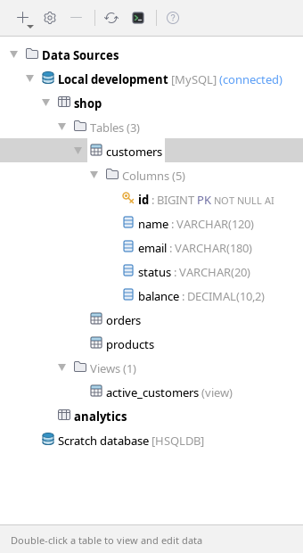
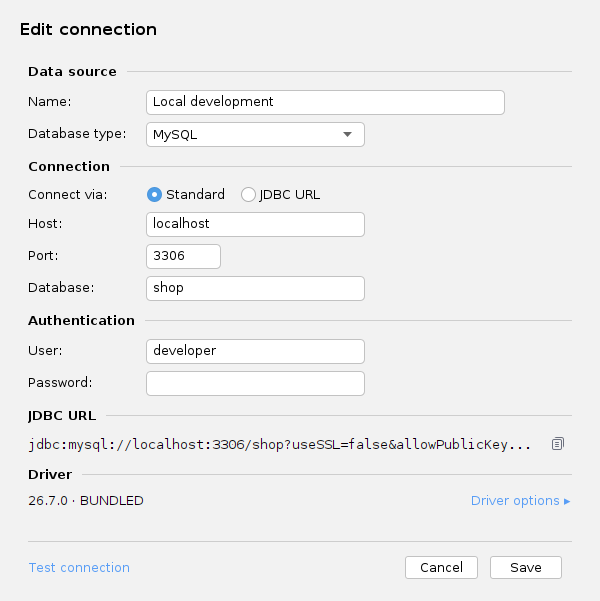
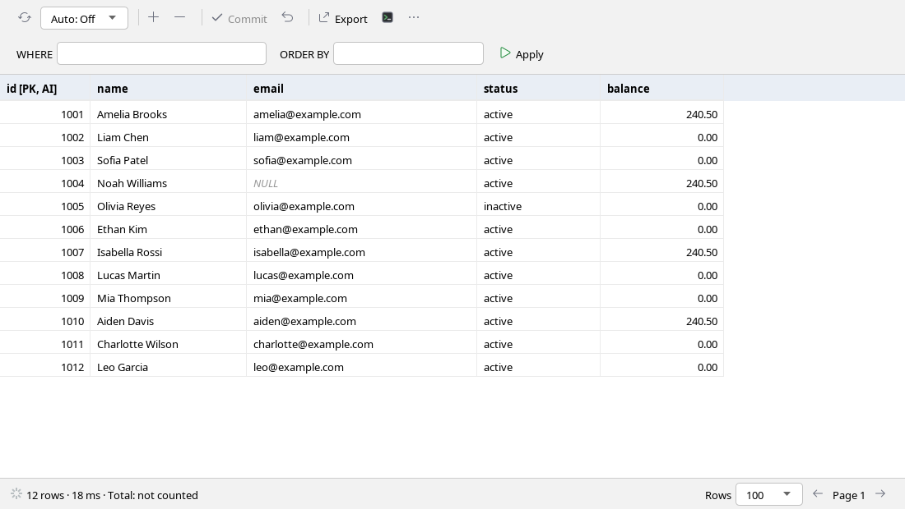
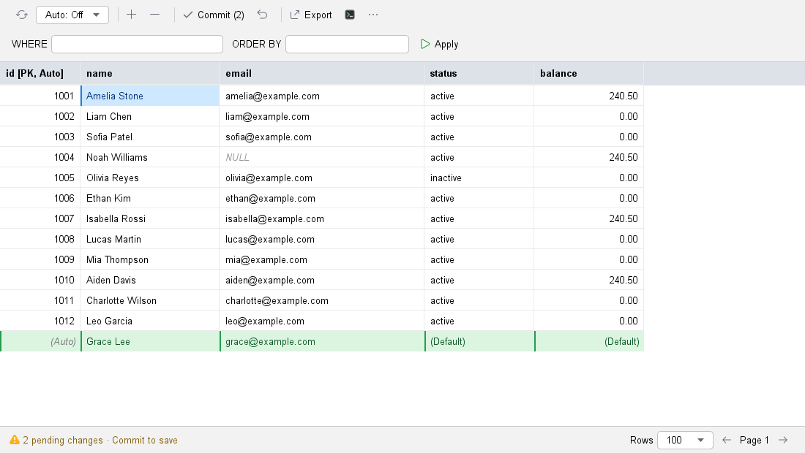
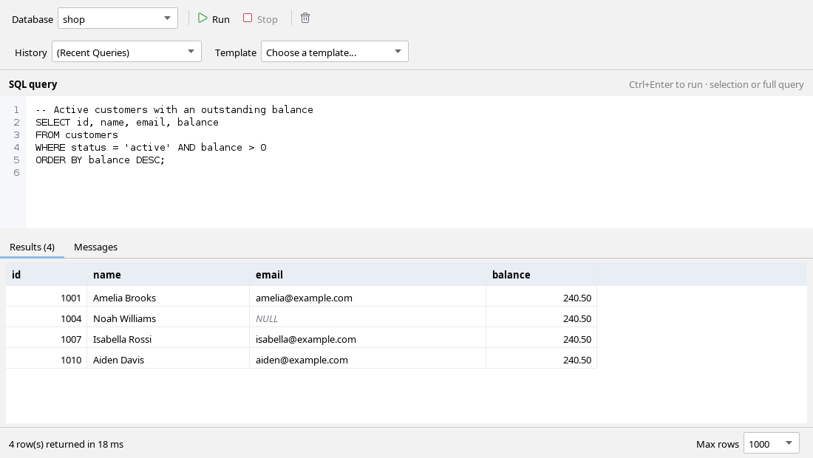

# Lattice


[](https://plugins.jetbrains.com/plugin/34772)
[](https://plugins.jetbrains.com/plugin/34772)
[](https://plugins.jetbrains.com/plugin/34772)
[](https://plugins.jetbrains.com/plugin/34772)

Lattice is a database management plugin for IntelliJ IDEA. Connect to MySQL or HSQLDB, browse schemas, run SQL, edit table data, design tables and export results from your IDE.

Built with help from **Gemini 3.8**, **GPT-6 Luna** and **GPT-6.1 Sol**.

## Features

- Explorer for schemas, tables, views, columns and primary keys.
- SQL console with results, history, row limits, timeouts and cancellation.
- Editable table grids with pagination, filtering, batch saves, explicit NULL/default values and draft recovery.
- Create/alter table dialogs and database/schema maintenance.
- CSV, JSON, SQL INSERT and CREATE TABLE exports.
- JDBC driver selection: bundled release, verified download from Maven Central, or local JAR.
- Server and driver version information through **Test Connection**.
- Passwords and custom JDBC URLs stored through IntelliJ PasswordSafe.

## Screenshots

Previews use sample data. These five screens are the featured UI previews.

### Side panel



### Connection dialog



### Table view



### Editing a table



### SQL console



## Requirements and compatibility

IntelliJ IDEA **2025.1 or later**, Community or Ultimate/unified editions, using the IDE's Java 21+ runtime. Windows, Linux and macOS are intended targets; hosted checks cover all three platforms. Interactive IDE testing remains pending.

| Database | Server releases exercised |
|---|---|
| MySQL | 5.5.62, 5.6.51, 5.7.44 and 8.4.2 |
| HSQLDB | 2.2.9 through 2.7.4; file, memory and server modes |

Choose a JDBC driver compatible with your server. HSQLDB requires a matching server/file format; some releases offer a `-jdk8` classifier. Java 8 support applies to drivers/database servers; the plugin requires Java 21. See the [compatibility report](docs/compatibility.md) for tested combinations and limits.

## Install and connect

### From JetBrains Marketplace (Recommended)
1. Open IntelliJ IDEA, go to **Settings → Plugins**.
2. Select the **Marketplace** tab, search for **Lattice**, and click **Install**.
   *(Direct link: [JetBrains Marketplace — Lattice](https://plugins.jetbrains.com/plugin/34772))*.

### From Disk (Offline / Release ZIP)
1. Download `Lattice-<version>.zip` from this repository's GitHub Releases.
2. Open **Settings → Plugins → gear menu → Install Plugin from Disk** in IntelliJ.
3. Select the ZIP and restart if prompted.
4. Open the **Lattice** tool window and add a data source.

Select MySQL or HSQLDB, enter connection details, and choose a driver:

- **Bundled**: Connector/J 9.0.0 or HSQLDB 2.7.3.
- **Download**: choose or enter a version and click **Download**. Downloads are explicit and checksum-verified.
- **Local JAR**: select an existing JDBC driver.

**Test Connection** reports the server product/version after authentication and the driver's version. Failed authentication or negotiation can prevent detection. JDBC downloads use the IDE system cache.

Generated MySQL URLs currently disable TLS and use UTC for the driver/server session. For remote or TLS-required servers, use a custom JDBC URL with your required security options. Custom URLs retain your options.

## Build from source

Install **JDK 21**, then clone this repository. The Gradle wrapper downloads the pinned Gradle distribution, IntelliJ SDK and dependencies; a preinstalled IntelliJ or database is not required for ordinary builds and pure tests.

Linux/macOS:

```bash
./gradlew test buildPlugin
```

Windows:

```powershell
.\gradlew.bat test buildPlugin
```

The ZIP is written to `build/distributions/`. The default version comes from `gradle.properties`; `-PreleaseVersion=1.0.1` overrides it. An optional `-Plattice.ide.home=/path/to/idea-2025.1` uses your own SDK.

For a common command on all three platforms, install Python 3.11+ and run:

```text
python scripts/test.py --build
python -m unittest discover -s scripts/tests -v
```

Use `python3` if that is your system's Python command. All optional development/release helpers live in `scripts/`; see the [script reference](docs/SCRIPTS.md). Only the conventional Gradle launchers remain in the repository root.

### Quick local UI testing

To preview the five featured screens without launching IDEA, run `python scripts/ui-preview.py` with JDK 21 and the cached IntelliJ SDK, then open `build/ui-preview/index.html`. Pass `--all-previews` to generate the complete light/dark gallery. Only the five featured images above are tracked in `screenshots/`; commit them when updating the UI. See [UI previews](docs/UI_PREVIEW.md) for setup, theme limitations and layout review notes. The [UI copy review](docs/UI_REVIEW.md) records label, icon and warning conventions.

To run the tooling and pure Java tests, build the ZIP, find an installed IntelliJ IDEA, and deploy the freshly built plugin:

```text
python scripts/dev-deploy.py
```

The cross-platform helper shows each step in the terminal. It prefers a running IDEA installation, validates the archive, replaces only Lattice, and restarts the selected IDE if it was running. A closed IDE stays closed. Save your IDE work first and respond to any exit prompts; the helper waits for shutdown and never force-kills the process. On Linux it uses `wmctrl` if available, otherwise SIGTERM.

Use `--dry-run` to inspect the target without making changes, `--list-ides` to list installations, or `--ide-home`, `--plugins-dir` and `--java-home` for explicit paths. Java 21 and an installed IDEA 2025.1+ are required; Gradle still compiles against the pinned 2025.1 SDK. See the [deployment helper reference](docs/SCRIPTS.md#quick-local-ide-deployment) for discovery, recovery, custom profiles and restart options.

## Functional tests

The live suites use disposable test schemas and require isolated fixtures. With JDK 21, Python 3.11+ and a running Docker engine:

```text
python scripts/test.py --live --mysql --hsqldb --build
```

The runner starts a temporary MySQL 8.4 container and an in-memory HSQLDB server, runs pure/integration/fallback-driver checks, and stops its owned fixtures even on test failure. Ports 3306 and 9001 must be free. No existing user database is used by this command.

See [CONTRIBUTING](docs/CONTRIBUTING.md) to use existing isolated fixtures. Generated classes, logs and reports stay in ignored `build/`. Downloads use your operating system's user cache, overridable with `LATTICE_DEV_CACHE`.

## Project layout

| Location | Contents |
|---|---|
| `src/` | Plugin source, resources and Java tests |
| [docs/](docs/README.md) | Development, release, support and compatibility guides |
| `scripts/` | Portable development and release helpers; tooling tests in `scripts/tests/` |
| `.github/` | GitHub issue forms, pull request template and workflows |
| `assets/`, `licenses/`, `lib/` | Branding, dependency license texts and fallback-test JDBC JARs |
| `build/` | Ignored generated output, distribution ZIPs and validation reports |
| `screenshots/` | The five tracked README preview images |

Workstation-only helpers and notes live in locally excluded `scripts/local/` and `docs/local/`. README, LICENSE, agent instructions and the Gradle wrapper launchers retain their root entry points.

## Releases and support

A tag such as `v1.0.1` or `v0.0.1-alpha` triggers the [release workflow](.github/workflows/release.yml): live tests, ZIP validation, IntelliJ 2025.1–2025.3 compatibility checks, then a GitHub Release with patch notes, commit history, checksums and corresponding MySQL sources. Versions with prerelease suffixes are marked as GitHub prereleases and are not designated latest. Manual workflow runs never publish.

See [CHANGELOG](docs/CHANGELOG.md), [RELEASING](docs/RELEASING.md), [issue reporting](docs/ISSUE.md), [security reporting](docs/SECURITY.md) and the [final review](docs/final-review.md). Marketplace publishing is a separate step.

## Known limits

HSQLDB multi-statement DDL is not atomic. Stable pagination without a primary key requires an explicit unique order. Partial CREATE reconstruction is labeled when native SCRIPT is unavailable. Connection failure during commit can leave an uncertain server outcome; verify persisted state before retrying. Interactive UI and dynamic unload checks remain pending.

## License

Lattice source is [MIT licensed](LICENSE). Bundled libraries retain their licenses; see [third-party notices](docs/THIRD_PARTY_NOTICES.md).
